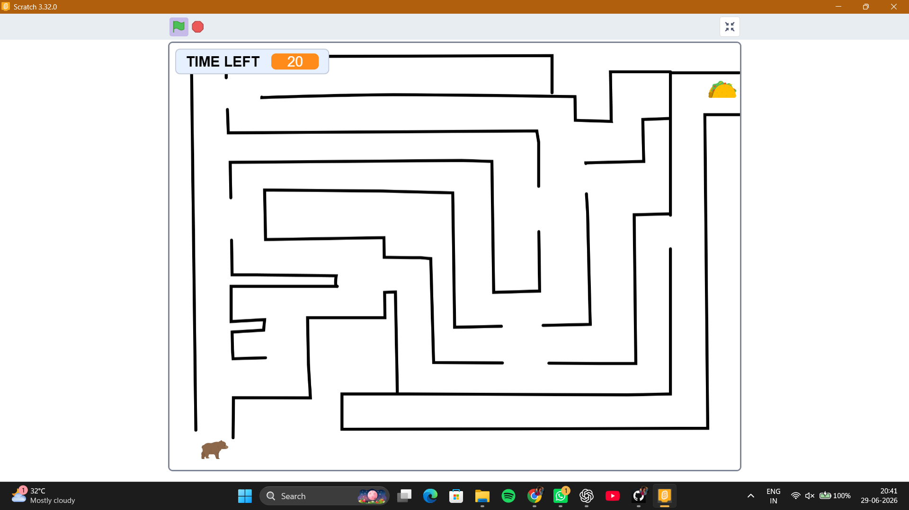

# Week 0 – Scratch Maze Game (THE TACO MAZE)

## Project Overview

I made this project for Week 0 of Harvards CS50x course. The Scratch Maze Game is a game where you have to navigate through a maze. You have to avoid obstacles and reach the goal. The goal of the Scratch Maze Game is to get to the end of the maze.

## Concepts Used

- Variables
- Loops
- Conditionals
- Custom Blocks
- Collision Detection
- Event Handling
- Broadcast Messages

## What I Learned

- I learned that it is helpful to break a problem into tasks. This makes it easier to solve the problem.

- I learned how to design game logic for the Scratch Maze Game. This means I figured out how to make the game work.

- I learned how to debug programs. This means I learned how to find and fix mistakes in the code.

- I learned how to use custom blocks to organize code. This makes the code easier to understand.

## Technologies Used

- Scratch
- CS50x

## Future Improvements

- I want to add levels to the Scratch Maze Game. This will make the game more fun.

- I want to add a scoring system to the game. This will make the game more fun and competitive.

- I want to add background music.
